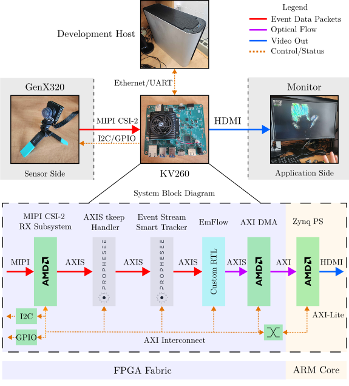

# EmFlow-FPGA

### Official repository for the EmFlow FPGA Hardware Accelerator
### [Zenodo Entry for the HFlow320 Dataset](https://zenodo.org/records/19669509) | Paper

The EmFlow-FPGA repo contains the RTL design code implementation for EmFlow, an event-based optical-flow SNN capable of real-time inference. The design has been tested on the AMD/Xilinx KV260 and connects a GenX320 event camera stream to the SNN pipeline in the PL. A block diagram of the system is shown below.



The repo contains the RTL, Vivado build scripts, an xsim/UVM verification testbench, a sample export of weights and parameters, and some Linux-side driver/display helpers that can be used to run the design on hardware. 

## Repository layout

```text
.
|-- drivers/          Linux kernel module, startup scripts, and display helpers
|-- ip/               Local Vivado IP repository used by the block design
|-- petalinux-projects/
|   `-- ...           PetaLinux project assets, where present
|-- rtl/
|   |-- src/          SystemVerilog and Verilog sources for the SNN accelerator
|   `-- xdc/          Timing and physical constraints
|-- scripts/          Non-project Vivado build flow
|-- verif/            xsim/UVM testbench, agents, tests, and debug vectors
`-- vivado_gui/       Tcl scripts for creating the Vivado block design
```

Important entry points:

- `rtl/src/flow_top.sv` is the top-level RTL wrapper for the accelerator.
- `scripts/Makefile` drives the Vivado build.
- `vivado_gui/01_setup_project.tcl`, `02_create_bd.tcl`, and `03_gen_products.tcl` recreate the block design.
- `verif/Makefile` runs xsim after the generated simulation Makefile exists.
- `drivers/snn.sh` configures the deployed board-side media pipeline and loads the `snn` FPGA app.

## Prerequisites
While the RTL sources are board agnostic (with the exception of a few XPM macros that must be replaced for other vendors), the build scripts in this repo showcase a demo design that can be built specifically towards the KV260 SOM with a Prophesee GenX320 DVS camera as it is based on the [starter kit design](https://docs.prophesee.ai/amd-kria-starter-kit/index.html).  **It is assumed that Vivado 2022.2 and PetaLinux 2022.2 are being used if you use the provided scripts. Otherwise, you may have to hack a few things to get it working.**

The scripts can be used to either simulate or run implementation on the design. In either case, ensure the following prerequisites are fulfilled.

### IP

The design uses a couple Prophesee IPs to handle the input event stream. Download the IP from the [prophesee-ai/fpga-projects](https://github.com/prophesee-ai/fpga-projects) repo and copy them into the `ip` directory.

### PetaLinux (Not needed if only performing simulations)

You can either build the PetaLinux image yourself by cloning the [prophesee-ai/petalinux-projects](https://github.com/prophesee-ai/petalinux-projects) repo and incorporating the `snn-firmware` recipe in the build, or by downloading the [Starter Kit Linux image](https://docs.prophesee.ai/amd-kria-starter-kit/application/app_deployment.html) (requires an account on the Prophesee Knowledge Center). If building yourself, the build follows the normal `petaLinux-build` process.

### Environment setup

Ensure Vivado 2022.2 is set up and accessible via the PATH by sourcing its setup scripts.
```bash
source <path-to-Vivado_2022.2>/Vivado/2022.2/settings64.sh
source <path-to-PetaLinux_2022.2>/settings.sh
```

Also ensure your Vivado installation contains the correct board/device parts for the KV260.

## Getting started

Clone the repo and enter it:

```bash
git clone <repo-url>
cd EmFlow-FPGA
```

Make sure Vivado is on your `PATH`:

```bash
vivado -version
```

Build the Vivado block design and run implementation:

```bash
cd scripts
make bd
make implementation
```

The build writes generated project files under `vivado_gui/myproj/` and build products under `outputs/`. The implementation flow writes the handoff and bitstream to:

```text
outputs/main.hwh
outputs/main.bit
outputs/main.xsa
```

Useful build targets (must run from the `scripts` directory):

```bash
make synthesis         # Run synthesis
make implementation    # Run implementation and write the final bitstream
make vivado            # Open the generated Vivado project
make debug             # Open Vivado with the hardware debug run mode
make clean             # Remove generated output files
make cleanest          # Remove output files and generated Vivado/simulation files
```

## Simulation

The verification environment uses Vivado's xsim and UVM. The `verif/Makefile` is used to run simulation commands, with recipe dependencies on `verif/Makefile_Auto.mk`. 

The `Makefile_Auto.mk` is generated from the `make_make.sh` script, which uses sources from the Vivado simulation export and `verif/sources.f` to build a dependency tree.

After the block design has been generated through `make bd` previously, create the simulation Makefile:

```bash
cd verif
./make_make.sh
```

Then compile and run a simulation:

```bash
make compile
make sim UVM_TESTNAME=test_inference UVM_VERBOSITY=LOW DEBUG_SRC=debug_export_25 GUI=1
```

The `DEBUG_SRC` flag is used to load one of the Python-exported samples for simulation-to-hardware verification. Several samples have been included as a demonstration.

Simulation logs and wave databases are written under `verif/output/`.

## Running on hardware

After flashing the PetaLinux image to an SD card, boot the board. If you built the PetaLinux image using the `snn-firmware` recipe, the `bit.bin`, `.dtbo`, and `.` should already be installed in the proper directory (`/firmware/lib/xilinx/snn`). If using a pre-built image, transfer the driver files over (`rsync` or some other means) to the firmware directory:
```
/firmware/lib/xilinx/snn
    |-- snn-firmware.bit.bin
    |-- snn-firmware.
    `-- vivado_gui/   
```

Transfer the `drivers` directory from this repo to the home directory of the board, then build the board-side driver and applications on the target Linux system:

```bash
cd drivers
make
```

This builds:

- `flow_driver.ko`, the kernel module driver.
- `flow_display`, an application that does minimal post-processing and just displays events on the screen
- `flow_color`, an application that encodes the optical flow vectors using the Middlebury color schemes and displays the result on the screen

Assuming the GenX320 camera and an HDMI/DisplayPort monitor is connected, the main startup script is:

```bash
sudo ./snn.sh
```
With optional bias presets that affect the GenX320's sensor configuration:

```bash
sudo ./snn.sh default
sudo ./snn.sh lowlight
sudo ./snn.sh min
```

After initialization, run one of the display tools:

```bash
./flow_display
./flow_color
```

## AXI4-Lite register map

The accelerator control register base is expected at `0xa0030000` in the current board scripts. The register map is as follows:

| Offset | Register | Description |
| --- | --- | --- |
| `0x00` | `slv_reg0` | Bit 0 enables the accelerator. Bit 1 reports busy status. |
| `0x04` | `slv_reg1` | Bit 0 enables performance counting. |
| `0x08` | `slv_reg2` | Event count. |
| `0x0c` | `slv_reg3` | Busy cycle count. |
| `0x10` | `slv_reg4` | Idle cycle count. |
| `0x14` | `slv_reg5` | Completed inference count. |
| `0x18` | `slv_reg6` | Layer E1 cycle count. |
| `0x1c` | `slv_reg7` | Layer E2 cycle count. |
| `0x20` | `slv_reg8` | Layer M1 cycle count. |
| `0x24` | `slv_reg9` | Layer M2 cycle count. |
| `0x28` | `slv_reg10` | Layer M3 cycle count. |
| `0x2c` | `slv_reg11` | Layer M4 cycle count. |
| `0x30` | `slv_reg12` | Layer D1 cycle count. |
| `0x34` | `slv_reg13` | Flow-head cycle count. |
| `0x38` | `slv_reg14` | Readability check value, set as `0xDEADBEEF`. |
| `0x3c` | `slv_reg15` | Timer window in microseconds. |
| `0x40` | `slv_reg16` | Flow-head stall count. |
| `0x44` | `slv_reg17` | Layer E1 spike count. |
| `0x48` | `slv_reg18` | Layer E2 spike count. |
| `0x4c` | `slv_reg19` | Layer M1 spike count. |
| `0x50` | `slv_reg20` | Layer M2 spike count. |
| `0x54` | `slv_reg21` | Layer M3 spike count. |
| `0x58` | `slv_reg22` | Layer M4 spike count. |
| `0x5c` | `slv_reg23` | Layer D1 spike count. |

Registers can be read by any means, the most simple of which is through `devmem`.

```bash
devmem 0xa0030000 32 1       # Manually Enable accelerator
devmem 0xa0030038 32         # Read the 0xDEADBEEF check register
```
## Cleaning generated files

The following targets can be used to clean build outputs.
```bash
cd scripts
make clean
make cleanest
```

Simulation outputs:
```bash
cd verif
make clean
```

## License

This project is licensed under the MIT License. See `LICENSE` for the full text.

## Citation

If you find this code useful in your own research, please cite the original works.
